# 🪙 Arua Finance — Smarter Money. Powered by AI.

<div align="center">


-059669?style=for-the-badge)


<br/>

**An intelligent, all-in-one personal wealth management and taxation ecosystem tailored specifically for Indian taxpayers, salaried professionals, and modern investors.**

<br/>

[🚀 Live Demo](#-live-demo) • [✨ Main Features](#-main-features) • [📸 Screenshots](#-screenshots) • [🛠️ Tech Stack](#%EF%B8%8F-tech-stack) • [⚡ Installation & Setup](#-installation-and-setup) • [👥 Our Team](#-our-team)

</div>

---

## 📑 Table of Contents

- [🌟 Project Overview](#-project-overview)
- [✨ Main Features](#-main-features)
  - [🤖 AI Money Coach](#1--ai-money-coach)
  - [📊 Financial Health Score](#2--financial-health-score)
  - [💡 Smart Budget Generator](#3--smart-budget-generator)
  - [🎯 Financial Goal Planner](#4--financial-goal-planner)
  - [🧾 Expense Tracker](#5--expense-tracker)
  - [⚡ Spending Insights & Alerts](#6--spending-insights-and-alerts)
  - [📈 Investment Simulator](#7--investment-simulator)
  - [🛡️ Emergency Fund Calculator](#8--emergency-fund-calculator)
  - [📑 Monthly AI Financial Report](#9--monthly-ai-financial-report)
  - [🧮 Smart Tax Planner (FY 2025–26)](#10--smart-tax-planner)
  - [📱 Mobile Number OTP Login](#11--mobile-number-otp-login)
  - [✉️ Email Login](#12--email-login)
  - [🍃 MongoDB Cloud Data Storage](#13--mongodb-cloud-data-storage)
  - [🧠 AI-Powered Financial Recommendations](#14--ai-powered-financial-recommendations)
- [🛠️ Tech Stack](#%EF%B8%8F-tech-stack)
- [📸 Screenshots](#-screenshots)
- [🚀 Live Demo](#-live-demo)
- [⚡ Installation and Setup](#-installation-and-setup)
- [🌐 Production Deployment Guide](#-production-deployment-guide)
  - [1. MongoDB Atlas Setup](#1-mongodb-atlas-cloud-database)
  - [2. Deploy Backend on Render](#2-deploy-backend-on-render)
  - [3. Deploy Frontend on Vercel](#3-deploy-frontend-on-vercel)
  - [4. Production Verification Checklist](#4-production-verification-checklist)
- [🔐 Environment Variables](#-environment-variables)
- [📁 Project Structure](#-project-structure)
- [👥 Our Team](#-our-team)
- [📄 License](#-license)

---

## 🌟 Project Overview

**Arua Finance** is a next-generation personal finance platform engineered to make money management intuitive, automated, and intelligent for Indian users.

Managing personal finances often involves juggling fragmented spreadsheets, generic calculators, and complex tax rules. Arua Finance unifies **daily expense tracking (₹), automated 50-30-20 budgeting, goal milestone forecasting, investment compounding simulations, emergency buffer calibration, and comprehensive Indian Income Tax (FY 2025–26) regime optimization** into a single glassmorphic, AI-powered platform.

Powered by **Google Gemini AI**, Arua Finance functions as an always-on personal financial advisor—diagnosing spending vitality, calculating financial health scores, providing proactive budget breach alerts, and optimizing tax deductions under Section 80C, 80D, Section 24, and HRA.

---

## ✨ Main Features

### 1. 🤖 AI Money Coach
- **Conversational Intelligence**: Powered by Google Gemini AI, users can ask complex financial questions in natural language regarding savings, debt reduction, SIP allocation, and tax planning.
- **Context-Aware Recommendations**: The AI evaluates the user's specific annual income, monthly expenses, active budget, and risk tolerance to generate tailored advice.

### 2. 📊 Financial Health Score
- **Dynamic 0–100 Vitality Index**: Real-time diagnostic calculated across four pillars: **Savings Ratio (30 pts)**, **Budget Discipline (25 pts)**, **Emergency Fund Runway (25 pts)**, and **Risk Alignment (20 pts)**.
- **Visual Tier Status**: Instant classification into *Poor*, *Fair*, *Good*, or *Excellent* with actionable steps to elevate financial resilience.

### 3. 💡 Smart Budget Generator
- **Automated 50/30/20 Allocation**: Intelligently divides monthly income into **Needs (50%)**, **Wants (30%)**, and **Savings & Investments (20%)**.
- **Real-Time Threshold Tracking**: Visual indicators and proactive warnings when discretionary spending approaches or exceeds allocated limits.

### 4. 🎯 Financial Goal Planner
- **Target & Horizon Planning**: Create custom milestones (e.g., *Home Down Payment*, *Emergency Corpus*, *Higher Education*, *Retirement Fund*).
- **Progress Tracking**: Dynamic progress bars, remaining target balances, and projected completion dates in Indian Rupees (₹).

### 5. 🧾 Expense Tracker
- **Categorized Logging**: Track transactions across key Indian spending categories (Food & Dining, Rent & Housing, Utilities, Entertainment, Healthcare, Shopping, Transport, EMI & Loans).
- **Payment Method Tagging**: Filter and log transactions by UPI, Credit Card, Debit Card, Net Banking, or Cash.

### 6. ⚡ Spending Insights and Alerts
- **Spending Analytics**: Identifies high-burn spending categories and month-over-month variances.
- **Proactive Notifications**: Real-time in-app banners and automated email notifications (via Nodemailer) when budget limits are breached.

### 7. 📈 Investment Simulator
- **SIP & Compounding Projections**: Interactive calculators simulating returns on Mutual Fund Systematic Investment Plans (SIPs), Fixed Deposits (FDs), Public Provident Fund (PPF), and Equity portfolios.
- **Customized Returns**: Adjust compounding frequency, expected annual return rate (%), and investment tenure (years).

### 8. 🛡️ Emergency Fund Calculator
- **Runway Assessment**: Calculates recommended cash buffers for 3-month, 6-month, and 12-month survival horizons based on essential monthly living expenses.
- **Shortfall Indicator**: Highlights the exact difference between current liquid savings and targeted emergency funds.

### 9. 📑 Monthly AI Financial Report
- **Automated Intelligence Dossier**: Summarizes monthly cash inflow, total burn rate, net savings rate, and goal progress.
- **AI Executive Summary**: Actionable summary written by Gemini AI highlighting financial milestones and recommendations for the upcoming month.

### 10. 🧮 Smart Tax Planner (FY 2025–26)
- **Old vs. New Regime Comparator**: Side-by-side tax comparison incorporating official FY 2025–26 slabs, the ₹75,000 New Regime standard deduction, and Section 87A rebates.
- **Advanced Deductions Calculator**: Includes Section 80C (PPF, ELSS, EPF up to ₹1.5L), Section 80D (Health Insurance), Section 24(b) (Home Loan Interest up to ₹2L), and other deductions.
- **HRA Exemption Calculator**: Computes Section 10(13A) metro (50%) and non-metro (40%) exemptions.
- **Advance Tax Schedule & ITR Form Selector**: Statutory quarterly payment deadlines (June 15, Sept 15, Dec 15, Mar 15) and ITR-1 to ITR-4 form selector.

### 11. 📱 Mobile Number OTP Login
- **Real SMS Verification**: Fast, passwordless mobile authentication via 2Factor SMS OTP gateway directly to Indian numbers (+91).

### 12. ✉️ Email Login
- **Secure Credentials**: Traditional email and password authentication with bcrypt hashing, rate limiting, and persistent JSON Web Token (JWT) sessions.

### 13. 🍃 MongoDB Cloud Data Storage
- **Cloud Synchronization**: Scalable data persistence with MongoDB Atlas for profiles, expenses, budgets, goals, and history.

### 14. 🧠 AI-Powered Financial Recommendations
- **Personalized Action Cards**: Smart advice cards highlighting portfolio adjustments, tax-saving moves, and budget improvements.

---

## 🛠️ Tech Stack

### Frontend


### Backend & Database


### AI & Third-Party Integrations


---

## 📸 Screenshots

<table align="center" width="100%">
  <tr>
    <td width="50%" align="center">
      
      <br/>
      <b>🏠 Landing & Hero Showcase</b>
      <p>Modern glassmorphic introduction highlighting core wealth modules.</p>
    </td>
    <td width="50%" align="center">
      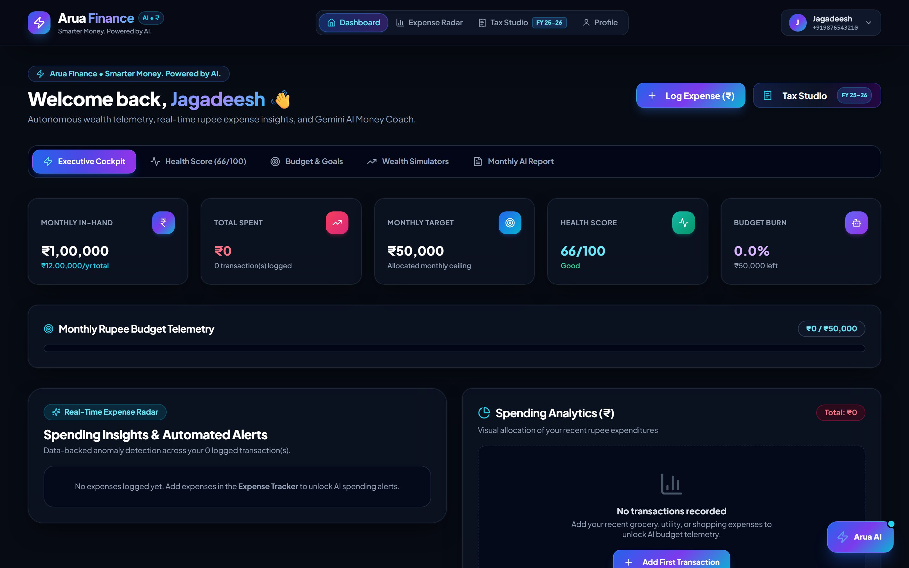
      <br/>
      <b>📊 Executive Financial Dashboard</b>
      <p>Real-time net worth, monthly budget utilization, and recent activity overview.</p>
    </td>
  </tr>
  <tr>
    <td width="50%" align="center">
      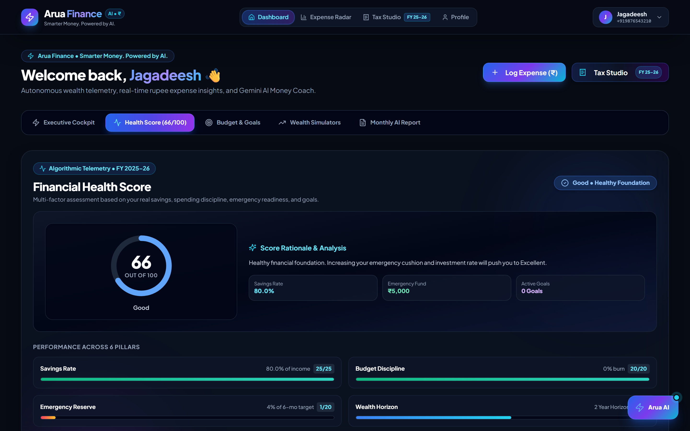
      <br/>
      <b>🩺 Financial Health Score</b>
      <p>Comprehensive 0–100 vitality scoring across savings, debt, and runway metrics.</p>
    </td>
    <td width="50%" align="center">
      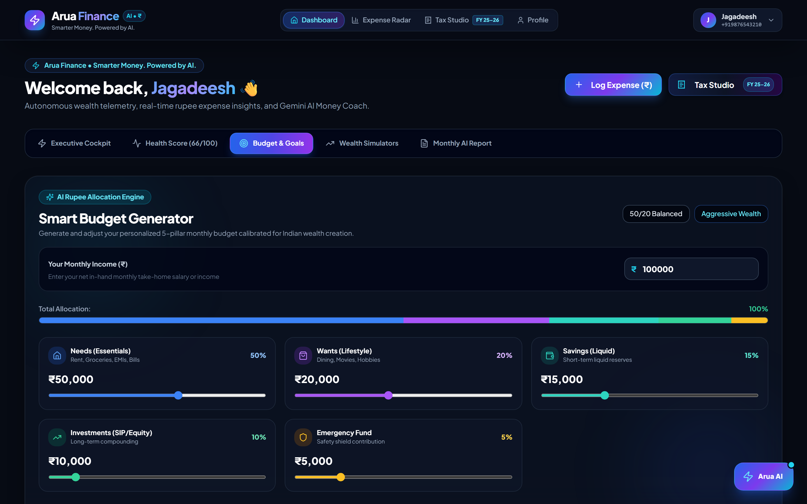
      <br/>
      <b>🎯 Smart Budget & Goals</b>
      <p>Automated 50-30-20 budget generator with milestone progress indicators.</p>
    </td>
  </tr>
  <tr>
    <td width="50%" align="center">
      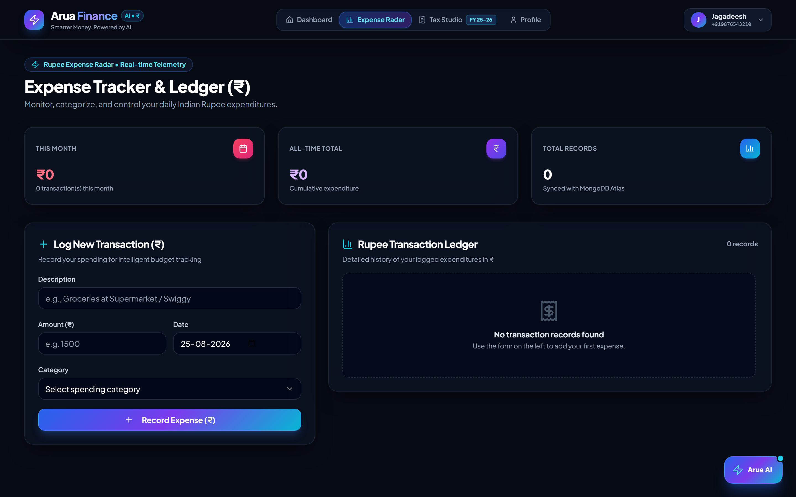
      <br/>
      <b>🧾 Expense Radar (₹)</b>
      <p>Granular transaction logging, category tags, and payment mode analytics.</p>
    </td>
    <td width="50%" align="center">
      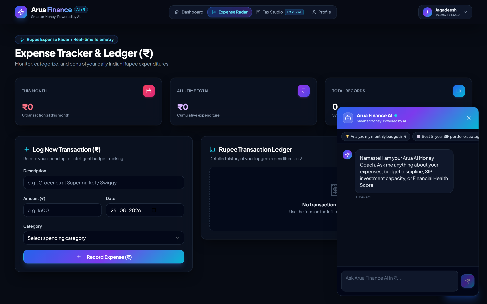
      <br/>
      <b>🤖 AI Money Coach</b>
      <p>Interactive Gemini AI chat advisor answering complex financial queries.</p>
    </td>
  </tr>
  <tr>
    <td width="50%" align="center">
      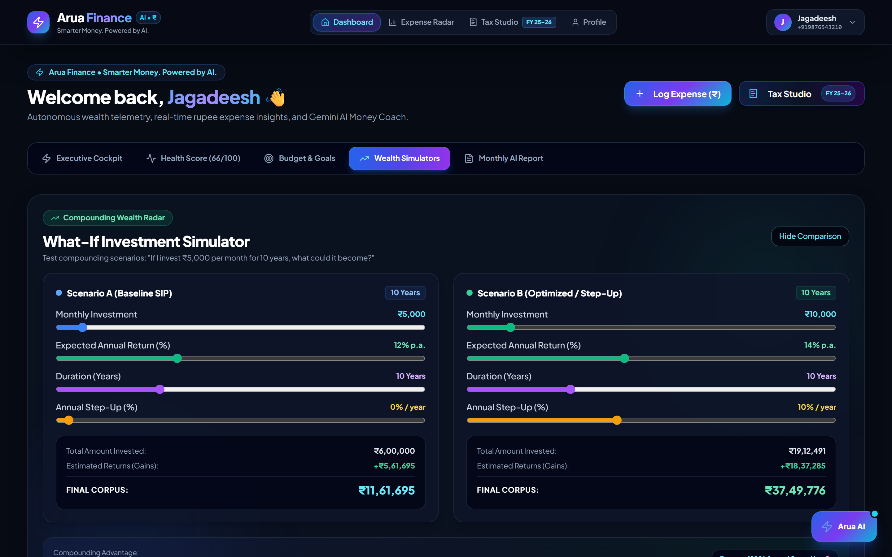
      <br/>
      <b>📈 Investment Simulator</b>
      <p>SIP compounding projections across custom return rates and time horizons.</p>
    </td>
    <td width="50%" align="center">
      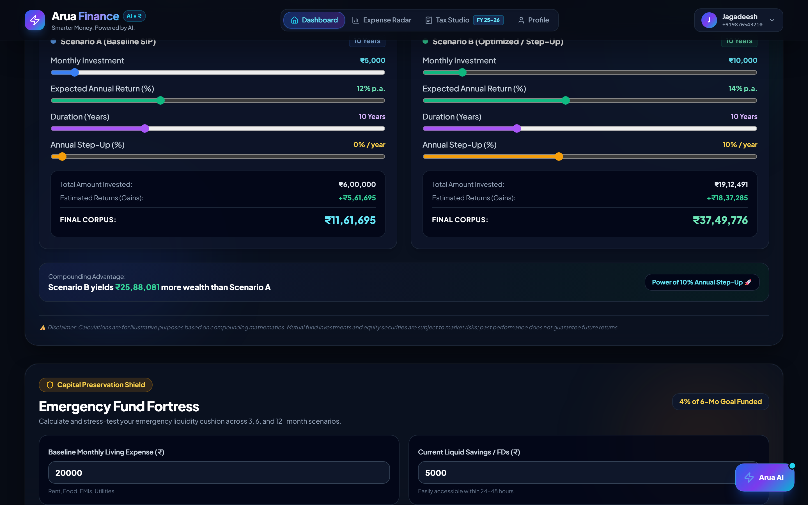
      <br/>
      <b>🛡️ Emergency Fund Buffer</b>
      <p>Runway estimator calculating 3, 6, and 12-month essential reserve requirements.</p>
    </td>
  </tr>
  <tr>
    <td width="50%" align="center">
      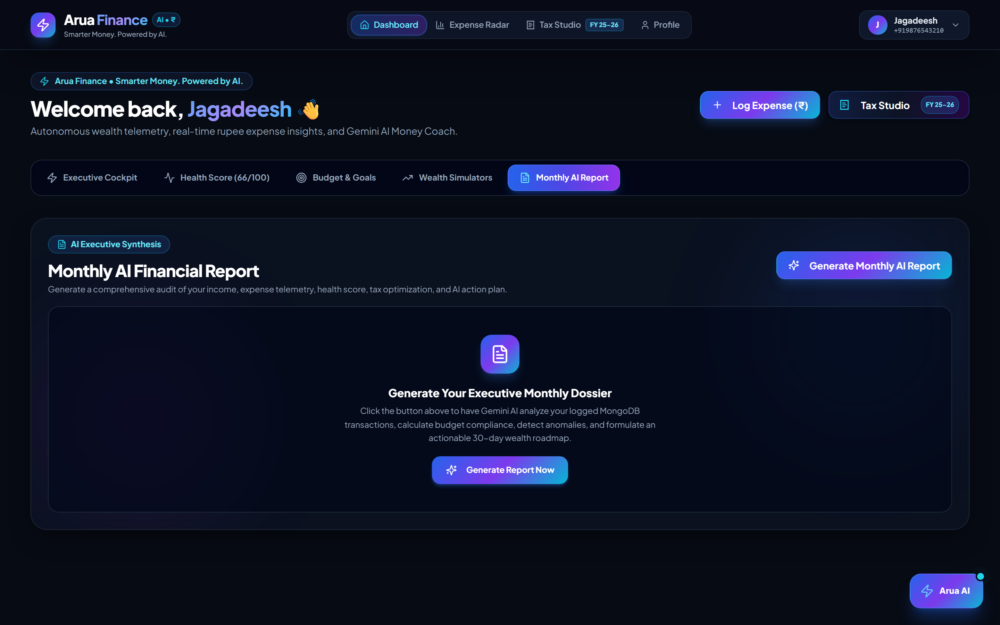
      <br/>
      <b>📑 Monthly AI Financial Report</b>
      <p>Automated intelligence dossier with cashflow metrics and AI executive summary.</p>
    </td>
    <td width="50%" align="center">
      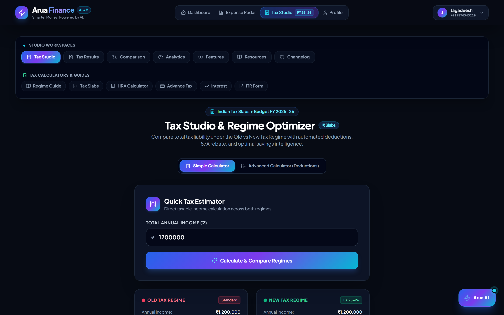
      <br/>
      <b>🧮 Tax Studio (FY 2025–26)</b>
      <p>Old vs New Regime optimizer with Section 80C, 80D, Section 24, and HRA tools.</p>
    </td>
  </tr>
  <tr>
    <td colspan="2" align="center">
      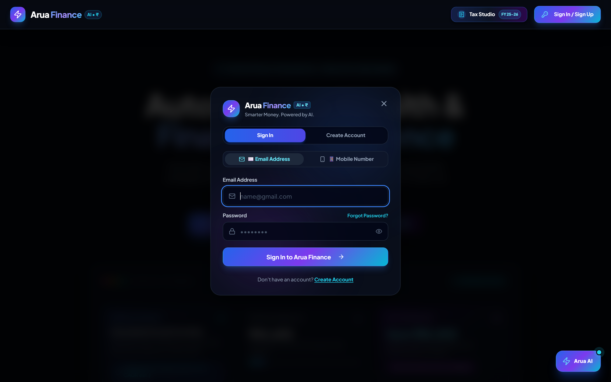
      <br/>
      <b>📱 Mobile SMS OTP & Email Authentication</b>
      <p>Real-time Indian mobile OTP verification and secure JWT sessions.</p>
    </td>
  </tr>
</table>

---

## 🚀 Live Demo

Experience **Arua Finance** live in your browser:

[](https://YOUR_LIVE_DEMO_URL_HERE)

> **🔗 Production Link:** `https://YOUR_LIVE_DEMO_URL_HERE`

---

## ⚡ Installation and Setup

Follow these step-by-step instructions to run Arua Finance locally on your machine.

### 📋 Prerequisites
- **Node.js** (v18.0.0 or higher)
- **npm** / **yarn** / **bun**
- **MongoDB Atlas** database or local MongoDB instance
- **Google Gemini API Key** (from [Google AI Studio](https://aistudio.google.com/))
- **2Factor SMS API Key** (optional for SMS OTP delivery)

---

### 1️⃣ Clone the Repository

```bash
git clone https://github.com/YOUR_ORGANIZATION_OR_USERNAME/arua-finance.git
cd arua-finance
```

---

### 2️⃣ Backend Setup

```bash
# Navigate to the backend directory
cd backend

# Install backend dependencies
npm install

# Create environment configuration file
cp .env.example .env
```

Open `backend/.env` in your text editor and configure your credentials:

```env
PORT=4000
MONGO_URI=YOUR_MONGODB_URI
DBName=AruaFinance
JWT_SECRET=YOUR_SECRET_KEY
GEMINI_API_KEY=YOUR_GEMINI_API_KEY
TWOFACTOR_API_KEY=YOUR_OTP_API_KEY
APIEMAILADDRESS=your_email@gmail.com
APIEMAILPASS=your_app_password
```

Start the backend server:

```bash
npm start
# Backend will run on http://localhost:4000
```

---

### 3️⃣ Frontend Setup

In a new terminal window:

```bash
# Navigate to the frontend directory
cd frontend

# Install frontend dependencies
npm install

# Create frontend environment configuration file
cp .env.example .env
```

Open `frontend/.env` and specify the backend API connection and Gemini key:

```env
VITE_SERVER_URL=http://localhost:4000
VITE_GEMINI_API_KEY=YOUR_GEMINI_API_KEY
```

Start the frontend development server:

```bash
npm run dev
# Frontend will run on http://localhost:8080 (or http://localhost:5173)
```

---

## 🌐 Production Deployment Guide

Arua Finance is designed for reliable, scalable production deployment across **Vercel** (Frontend SPA), **Render** (Node/Express API), and **MongoDB Atlas** (Cloud Database).

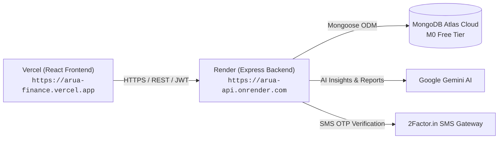

### 1. MongoDB Atlas (Cloud Database)
1. Sign in to [MongoDB Atlas](https://cloud.mongodb.com/).
2. Create a Free Cluster (e.g. `Cluster0` in `AWS / Mumbai` or your nearest region).
3. Under **Database Access**, create a database user with a secure password.
4. Under **Network Access**, click **Add IP Address** and choose **Allow Access from Anywhere (`0.0.0.0/0`)** so Render can dynamically connect.
5. Click **Connect** > **Drivers (Node.js)** and copy your connection string:
   ```text
   mongodb+srv://<username>:<password>@cluster0.mongodb.net/?retryWrites=true&w=majority
   ```

---

### 2. Deploy Backend on Render
1. Push your repository to **GitHub**.
2. Sign in to [Render](https://dashboard.render.com/) and click **New > Web Service**.
3. Connect your GitHub repository.
4. Configure the Web Service settings:
   - **Name**: `arua-finance-backend`
   - **Root Directory**: `backend`
   - **Environment**: `Node`
   - **Build Command**: `npm install`
   - **Start Command**: `npm start`
   - **Plan**: `Free`
5. In the **Environment Variables** tab, add the production variables:
   - `NODE_ENV`: `production`
   - `MONGO_URI`: `mongodb+srv://<username>:<password>@cluster0.mongodb.net/?retryWrites=true&w=majority`
   - `DBName`: `arua_finance`
   - `JWT_SECRET`: `your_secure_32_character_jwt_secret_key`
   - `CLIENT_URL`: `https://your-arua-frontend.vercel.app`
   - `GEMINI_API_KEY`: `your_gemini_api_key`
   - `TWOFACTOR_API_KEY`: `your_2factor_api_key`
   - `OTP_LENGTH`: `6`
6. Click **Deploy Web Service**.
7. Once deployed, verify `https://arua-finance-backend.onrender.com/api/health`.
8. Copy your Render service URL (e.g. `https://arua-finance-backend.onrender.com`).

---

### 3. Deploy Frontend on Vercel
1. Sign in to [Vercel](https://vercel.com/) and click **Add New > Project**.
2. Import your GitHub repository.
3. In the project setup configuration:
   - **Framework Preset**: `Vite`
   - **Root Directory**: Click *Edit* and select `frontend`
   - **Build Command**: `npm run build`
   - **Output Directory**: `dist`
   - **Install Command**: `npm install`
4. In the **Environment Variables** section, configure:
   - `VITE_SERVER_URL`: `https://your-arua-finance-backend.onrender.com` (from Step 2)
   - `VITE_GEMINI_API_KEY`: `your_gemini_api_key`
   - `VITE_OTP_LENGTH`: `6`
5. Click **Deploy**.
6. Vercel will build and assign your production domain (e.g. `https://arua-finance.vercel.app`).

---

### 4. Production Verification Checklist
1. **Frontend SPA Navigation**: Reload pages on `/dashboard`, `/calculate`, `/expenses`, and `/profile` to ensure single-page route rewrites pass without 404s.
2. **Backend API Health**: Visit `https://your-backend.onrender.com/api/health` and verify `{"status":"ok","database":"connected"}`.
3. **CORS Alignment**: Ensure `CLIENT_URL` on Render matches your live Vercel domain (`https://your-project.vercel.app`).
4. **Auth & SMS Flow**: Test OTP dispatch and login on the live production frontend.

---

## 🔐 Environment Variables

> [!IMPORTANT]
> **Security Notice**: Never commit actual API keys, database connection strings, passwords, or authentication secrets to public repositories. Always use `.env` files and add them to `.gitignore`.

### 🖥️ Frontend Environment Variables (`frontend/.env`)

| Variable Name | Description | Placeholder |
|:---|:---|:---|
| `VITE_SERVER_URL` | Base URL of the Express backend API | `http://localhost:4000` |
| `VITE_GEMINI_API_KEY` | Client-side Google Gemini AI API key | `YOUR_GEMINI_API_KEY` |

### ⚙️ Backend Environment Variables (`backend/.env`)

| Variable Name | Description | Placeholder |
|:---|:---|:---|
| `PORT` | Port number for Express server | `4000` |
| `MONGO_URI` | MongoDB Atlas cluster connection string | `YOUR_MONGODB_URI` |
| `DBName` | Database collection name | `AruaFinance` |
| `JWT_SECRET` | Secret key for signing JWT auth tokens | `YOUR_SECRET` |
| `GEMINI_API_KEY` | Google Gemini API key for AI Coach & Reports | `YOUR_GEMINI_API_KEY` |
| `TWOFACTOR_API_KEY` | 2Factor.in SMS gateway API key | `YOUR_OTP_API_KEY` |
| `APIEMAILADDRESS` | SMTP email address for sending budget alerts | `your_alerts@domain.com` |
| `APIEMAILPASS` | SMTP application password for email delivery | `your_email_app_password` |

---

## 📁 Project Structure

```text
arua-finance/
├── backend/
│   ├── MongoDBConnection.js      # MongoDB Atlas connection & event listeners
│   ├── ai.service.js             # Google Gemini AI integration & report generator
│   ├── index.js                  # Express application, routes, and rate-limiting
│   ├── package.json              # Backend dependencies and scripts
│   ├── sendMail.controller.js    # Nodemailer email alert controller
│   ├── twofactor.service.js      # 2Factor SMS OTP gateway service
│   ├── user.controller.js        # User profile, goals, and expense CRUD
│   └── user.model.js             # Mongoose user schema & data validation
│
├── frontend/
│   ├── public/                   # Static assets & favicons
│   ├── src/
│   │   ├── components/           # Reusable UI & Financial components
│   │   │   ├── AIRecommendations.jsx        # Smart recommendation cards
│   │   │   ├── CalculateCompo.jsx           # Tax Studio & Slabs (FY 25–26)
│   │   │   ├── ChatBotGemini.jsx            # Interactive Gemini AI Coach
│   │   │   ├── EmergencyFundCalculator.jsx  # Emergency cash buffer tool
│   │   │   ├── ExpenseSummary.jsx           # Real-time expense breakdown
│   │   │   ├── FinancialGoalPlanner.jsx     # Goal tracker & milestones
│   │   │   ├── FinancialHealthScore.jsx     # 0–100 vitality index
│   │   │   ├── InvestmentSimulator.jsx      # SIP & compounding projector
│   │   │   ├── MonthlyFinancialReport.jsx   # Automated monthly summary
│   │   │   ├── Navbar.jsx                   # Sticky glassmorphic navigation
│   │   │   ├── PhoneAuthModal.jsx           # SMS OTP & Email auth modal
│   │   │   ├── SmartBudgetGenerator.jsx     # 50-30-20 budget generator
│   │   │   ├── SpendingInsights.jsx         # Category alerts & patterns
│   │   │   └── ui/                          # Radix UI / Shadcn UI components
│   │   ├── helper/               # Auth providers, API callers & formatters
│   │   │   ├── auth.jsx                     # Authentication context & hooks
│   │   │   ├── formatters.js                # Currency (₹) and date formatters
│   │   │   ├── healthScore.js               # Scoring algorithm logic
│   │   │   └── SaveUserDataFunc.js          # API sync helpers
│   │   ├── pages/                # Main route views
│   │   │   ├── Dashboard.jsx                # Core wealth dashboard
│   │   │   ├── ExpenseTracker.jsx           # Expense radar & transaction list
│   │   │   ├── Index.jsx                    # Landing page & feature showcase
│   │   │   ├── NotFound.jsx                 # 404 handler
│   │   │   └── Profile.jsx                  # User profile & calibration
│   │   ├── App.jsx               # Application router & provider wrapper
│   │   ├── index.css             # Tailwind design system & gradients
│   │   └── main.jsx              # React entry point
│   ├── package.json              # Frontend dependencies and scripts
│   └── vite.config.js            # Vite build configuration
│
├── screenshots/                  # Documentation images and UI previews
└── README.md                     # Project documentation
```

---

## 👥 Our Team

<div align="center">

<table align="center">
  <tr>
    <td align="center" width="16.66%">
      <a href="https://github.com/praveenkumar-AI05">
        <br/>
        <br/>
        <b>T. Praveen Kumar</b>
      </a>
    </td>
    <td align="center" width="16.66%">
      <a href="https://github.com/shaiks67">
        <br/>
        <br/>
        <b>S. Mohammad Rafiq</b>
      </a>
    </td>
    <td align="center" width="16.66%">
      <a href="https://github.com/Charankumar-coded">
        <br/>
        <br/>
        <b>G. Charan Kumar</b>
      </a>
    </td>
    <td align="center" width="16.66%">
      <a href="https://github.com/jagadeesh832-cpu">
        <br/>
        <br/>
        <b>V. Jagadeesh</b>
      </a>
    </td>
    <td align="center" width="16.66%">
      <a href="https://github.com/vinusha986">
        <br/>
        <br/>
        <b>G. Vinusha</b>
      </a>
    </td>
    <td align="center" width="16.66%">
      <a href="https://github.com/hhanumanthgowd-sketch">
        <br/>
        <br/>
        <b>P. Bhavya</b>
      </a>
    </td>
  </tr>
</table>

</div>

---

## 📄 License

This project is licensed under the **MIT License** — feel free to use, modify, and distribute with attribution.

<div align="center">

**Built with ❤️ for Indian Taxpayers & Modern Investors**

⭐ **Star this repository if you find it helpful!**

</div>
